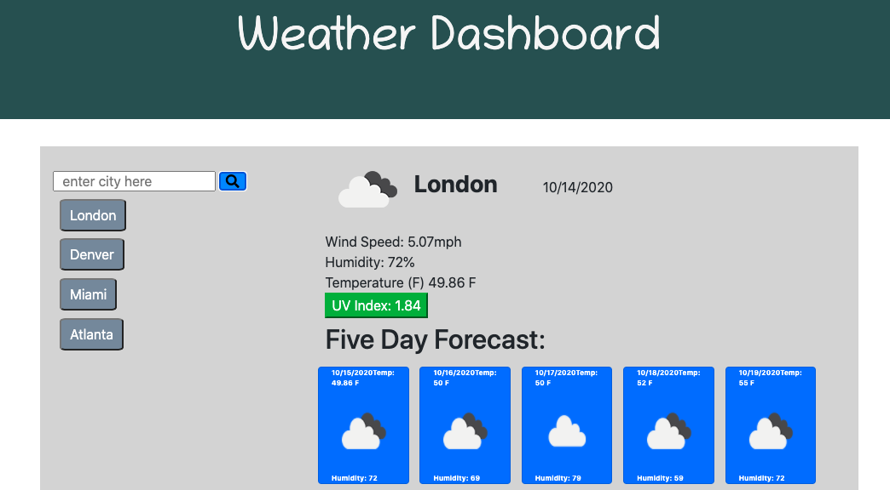

Purpose:
APIs are sources of information that developers can use in developing another platform. The purpose of this was to use a weather API to retrieve: current weather, UV index, and the five day forecast. The Open Weather API was the source of this information.

Usage

User can retrieve data for cities. Search parameter is listed dynamically. Current conditions and the five day forecast are displayed upon button click. UV index is color-coded based on level.

Completed application:

